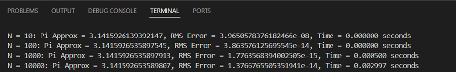

# Tugas Implementasi Integrasi Numerik
## Deskripsi
Merupakan implementasi kode untuk permasalahan Integrasi Numerik yang dibuat dengan bahasa Python. Berisikan 1 metode penyelesaian yaitu:
- Metode Simpson 1/3  

|   |   |
|---|---|
|Nama | Naufal Izzuddin Taufik |
|NIM | 21120122140102 |
|Kelas | Metode Numerik B| 
 

## Hasil
### Metode Simpson 1/3

